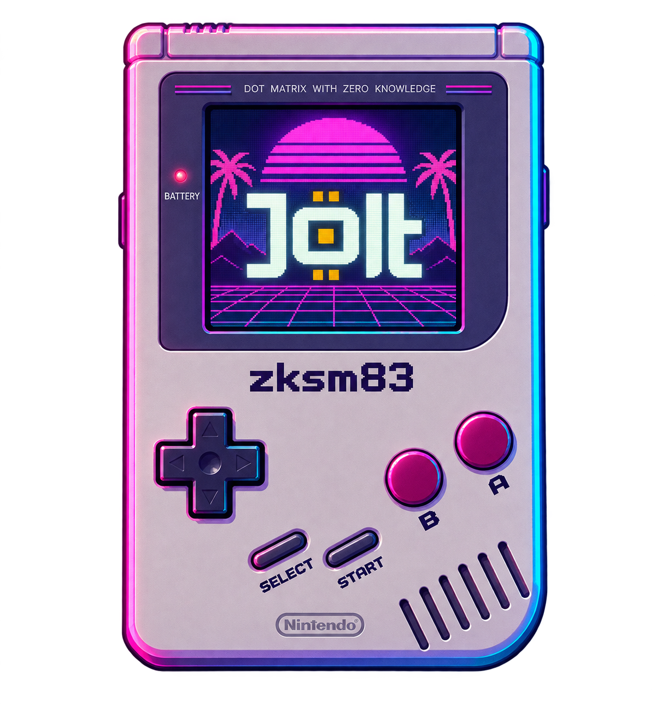

<p align="center">
  
</p>

# zksm83

`zksm83` is an experimental proof system for the SM83 CPU core used by the
original Nintendo Game Boy (DMG).

Given a cartridge, an initial machine state, and an input sequence, the prover
executes the Game Boy hardware model and produces a cryptographic receipt. A
verifier can check that the claimed final state and public outputs follow from
the modeled SM83 execution without replaying the whole game.

This proves execution of the hardware model. It does **not** authenticate a
physical Nintendo chip, prove that a cartridge dump is legally owned, or
reproduce pixels and audio as part of the proof. Nintendo and Game Boy are
trademarks of Nintendo; this independent research project is not affiliated
with or endorsed by Nintendo.

> [!WARNING]
> **Unstable experimental software.** The proof composition, receipt format,
> performance, and APIs can change without compatibility support. The project
> has not received a production security audit. Do not use it to secure assets
> or make production claims.

## What is proved?

The current machine profile covers the CPU-visible behavior needed to prove a
DMG execution:

- the primary and CB-prefixed SM83 instruction sets, registers, flags, jumps,
  stack operations, interrupts, HALT behavior, and machine-cycle accounting;
- an immutable cartridge ROM of up to one MiB;
- ordered 128-KiB mutable memory and no-RTC MBC3 mapping;
- Timer, PPU timing and interrupts, OAM DMA, serial, joypad, APU registers,
  Wave RAM, and MMIO behavior;
- ordered bus, private-input, public-output, and ISA logs; and
- continuity between independently proved execution segments.

Framebuffer rendering and generated audio samples are outside the relation.
The proof binds the CPU-visible device state that can affect program execution,
not a complete audiovisual Game Boy emulator.

The verifier is given a separately pinned public statement. The receipt alone
is not authorization. The statement fixes the protocol/backend identity, ROM
commitment, initial and final boundaries, segment and transition counts,
machine-cycle count, and log counts.

## Proof architecture

There is one current proof path: `zksm83-jolt`.

1. A native SM83 executor creates a typed execution trace.
2. Up to four ordinary instructions are packed into one relation row; machine
   events that require an exact boundary use their own row.
3. Jolt-like lookup arguments authenticate the fixed ISA, ROM, byte-level CPU
   operations, mutable memory, and ordered logs.
4. Sumcheck proves the native CPU and device relations over the packed trace.
5. The Akita lattice PCS commits to the witness and opens the values required
   by the verifier.
6. Long executions are chained as independently verifiable v2 segments.

This is a native SM83 Jolt-like construction, not a Game Boy emulator compiled
through an RV64 guest and not a wrapper around upstream Jolt's RV64 machine.
Halo2/Pasta and MOVA have been removed. There is no v1 fallback or dual receipt
decoder.

Akita is transparent and lattice-based, but the current protocol is **not
witness-hiding zero knowledge**. The repository name should not be read as a
claim that private traces are hidden.

## Paper performance estimate

No complete proof or benchmark was run to produce the numbers below. They are
a source-level model of the current implementation and must not be quoted as
measured performance.

One fixed-capacity v2 segment currently has:

| Quantity | Current source value |
| --- | ---: |
| Packed relation rows | 16,384 |
| Ordinary instructions per row | up to 4 |
| Logical / physical columns | 4,604 / 4,608 |
| Constraint slots | 11,458 |
| Maximum relation degree | 23 |
| Sumcheck interpolation points per round | 25 |
| Commitment groups / paired openings | 36 / 18 |
| Main-trace pair-opening tasks across the composed proof | about 37 |
| Raw logical `u64` witness | 575.5 MiB |
| Same cells represented as 128-bit field elements | about 1.125 GiB |

The main CPU sumcheck performs
`25 × (16,384 - 1) = 409,575` full relation evaluations per segment. That is
about 4.69 billion constraint-slot evaluations before the extra relation
validation, lookup, commitment, opening, and encoding work.

For ten seconds of DMG time, the hardware budget is:

```text
4,194,304 clock ticks/s ÷ 4 × 10 s = 10,485,760 machine cycles
```

Using a paper model of 3–7 minutes per segment on a 64-GB M1 Max, with segments
proved serially by the current CPU implementation:

| Workload model for 10 seconds | Estimated segments | Paper proving time |
| --- | ---: | ---: |
| Typical game using VBlank/HALT compression | 50–90 | 2.5–10.5 hours |
| CPU kept busy, averaging 3–5 M-cycles per packed row | 128–214 | 6–25 hours |
| Control-flow/MMIO/device-boundary heavy | 213–320 | 11–37 hours |
| Stress case near one M-cycle per row | about 640 | 32–75 hours |

The practical center estimate for an ordinary ten-second play interval is
about **6 hours**, with **8–10 hours** as a conservative planning number. That
is roughly **2,000–3,600 times slower than real time**. Workload-dependent
packing makes this range wide; it is not a formal upper bound.

The current code has no CUDA prover. Merely running it on a machine containing
an NVIDIA V100 does not provide a GPU speedup; field arithmetic, sumcheck,
folding, and Akita commitment/opening kernels would first need a real CUDA
implementation and separate measurement.

## Project status

The repository is in an unstable experimental phase:

- v2 is the only supported protocol and breaking changes are intentional;
- default CI checks formatting, strict lint, compilation, and proof-free
  semantic tests;
- expensive end-to-end cryptographic proof tests are opt-in and excluded from
  normal CI;
- the current relation and receipt path are implemented, but a full current
  Game Boy workload has not been proved and timed end to end;
- performance numbers in this README are paper estimates, not benchmarks; and
- the protocol is transparent, not witness hiding.

The implementation is cartridge-generic. Production code must not branch on a
ROM digest, title, program counter, bank, or expected instruction pattern to
compress a particular game.

## Workspace

| Crate | Responsibility |
| --- | --- |
| `zksm83-isa` | Typed primary and CB opcode metadata |
| `zksm83-core` | Deterministic machine state and the sole transition relation |
| `zksm83-memory` | ROM/RAM images and witness-side authentication |
| `zksm83-trace` | Validated bounded witness construction and block packing |
| `zksm83-jolt` | Native relations, Akita prover, receipt stream, and verifier |

## Build and check

The workspace uses the Rust toolchain pinned in `rust-toolchain.toml`.

```sh
cargo fmt --all -- --check
cargo clippy --workspace --all-targets --locked -- -D warnings
cargo test --workspace --all-targets --locked
```

The last command runs proof-free tests only. Tests that construct real
cryptographic proofs are marked ignored and must be selected explicitly.

ROMs, save files, input schedules, checkpoints, spools, receipts, statements,
traces, benchmarks, and temporary proof data are local-only and excluded by
the repository ignore rules.

## Preflight without proving

Preflight validates inputs, protocol bounds, commitments, and the expected end
checkpoint without producing proof data:

```sh
cargo run --release -p zksm83-jolt --bin zksm83-native-prover -- \
  --rom /absolute/path/cartridge.gb \
  --input /absolute/path/input-schedule.json \
  --expected-checkpoint /absolute/path/expected-endpoint.json \
  --spool /absolute/path/native.spool \
  --progress-checkpoint /absolute/path/native.progress.json \
  --receipt /absolute/path/native.receipt.bin \
  --statement /absolute/path/native.statement.bin \
  --preflight-only
```

## Prove, resume, and inspect

Replace `--preflight-only` with `--segment-limit 1` for a bounded first proof
run. Repeat the same command with `--resume` to verify the durable prefix and
continue from the exact saved boundary.

Use `--inspect-progress-only` with the same paths to verify an existing
progress/spool pair without opening it for writing. Inspection checks every
stored proof frame, segment counters, final state and memory commitment, the
receipt version, protocol identity, backend digest, and trace schedules. It
does not truncate, continue execution, or create a receipt.

A partial spool is never published as the final receipt. Finalization writes
the statement first and the receipt last, so the receipt acts as the completion
marker.

## Verify a receipt

Verification requires the expected statement as a separate policy input:

```sh
cargo run --release -p zksm83-jolt --bin zksm83-native-verifier -- \
  /absolute/path/expected-statement.bin \
  /absolute/path/native-receipt.bin
```

The verifier decodes one bounded segment at a time and does not need the
emulator, execution trace, cartridge image, memory image, or private log
values.

## License

The workspace is licensed under [GPL-3.0-only](LICENSE).
